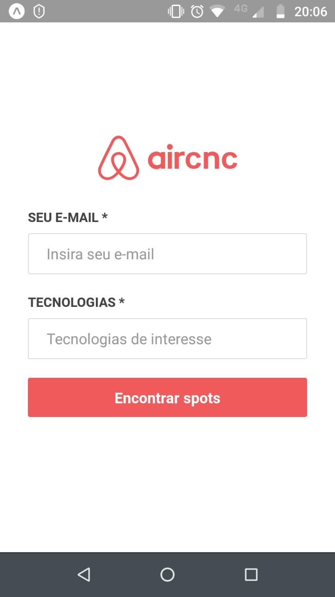
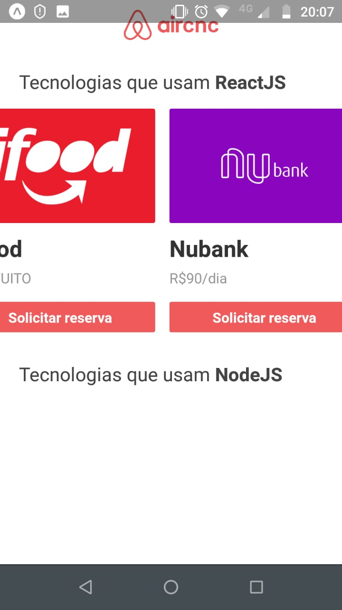
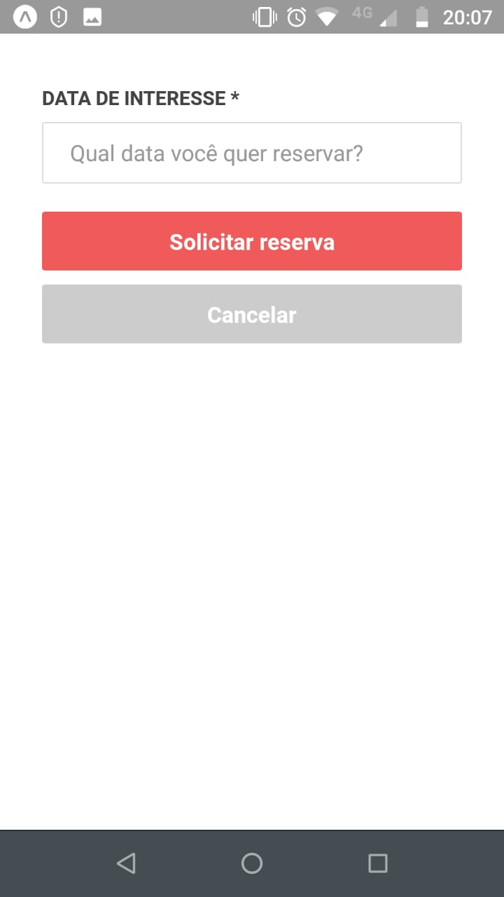
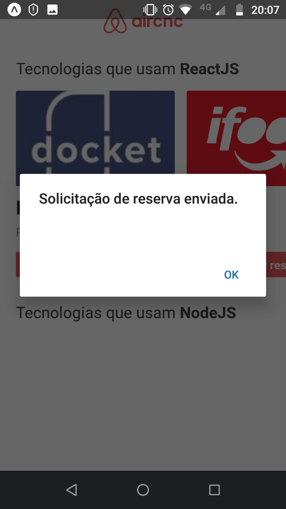

# AirCnC - AirBnB Interface Clone

A React, React Native and NodeJS application developed during Semana Omnistack 9.0 by @Rocketseat

## Interface Web


## Interface Mobile










## Running in Development

### NodeJS

After cloning this repository, go to the 'code' directory, then install dependencies:

```
# installs the dependencies
yarn install
```

As long as it's done, run the server with nodemon:

```
# runs the NodeJS service with nodemon
yarn dev
```

### ReactJS

Go to the 'web' directory, then install dependencies: 

```
# installs the dependencies
yarn install
```

Run the app:


```
# starts react app
yarn start
```

The app will be available in http://localhost:3000


### React Native

In this projects [Expo](https://expo.io/) was used. So install and configure Expo, then in directory 'mobile' run:

```
# runs the mobile app in your smartphone:
  yarn start
```